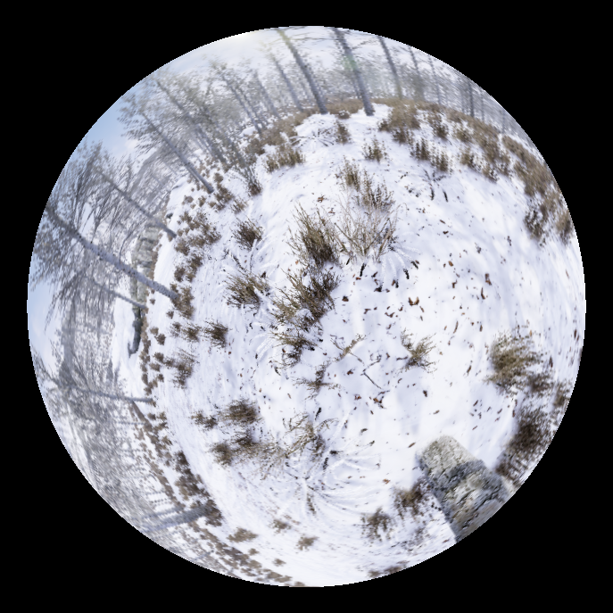
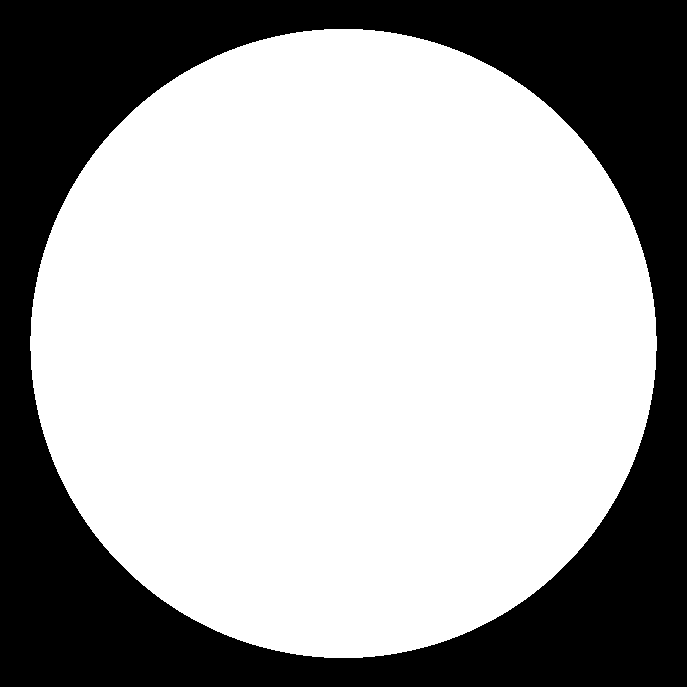
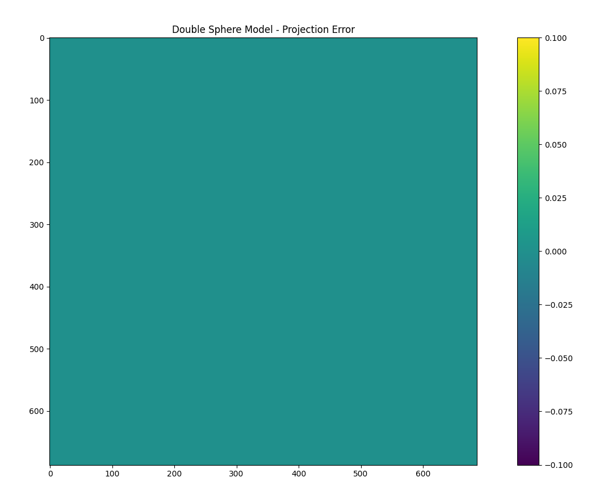

# Double Sphere Camera Model Check

- Implemented the [double sphere camera model](https://arxiv.org/abs/1807.08957) for fisheye lens.
- Added code to verify the overall projection error to verify whether this model actually works for our fisheye lens parameters.

- Added a script to generate mask using a synthetically generated fisheye image

| Fisheye | Mask | Projection Error|
| ------- | ---- | --------------- |
|  |  |  |
